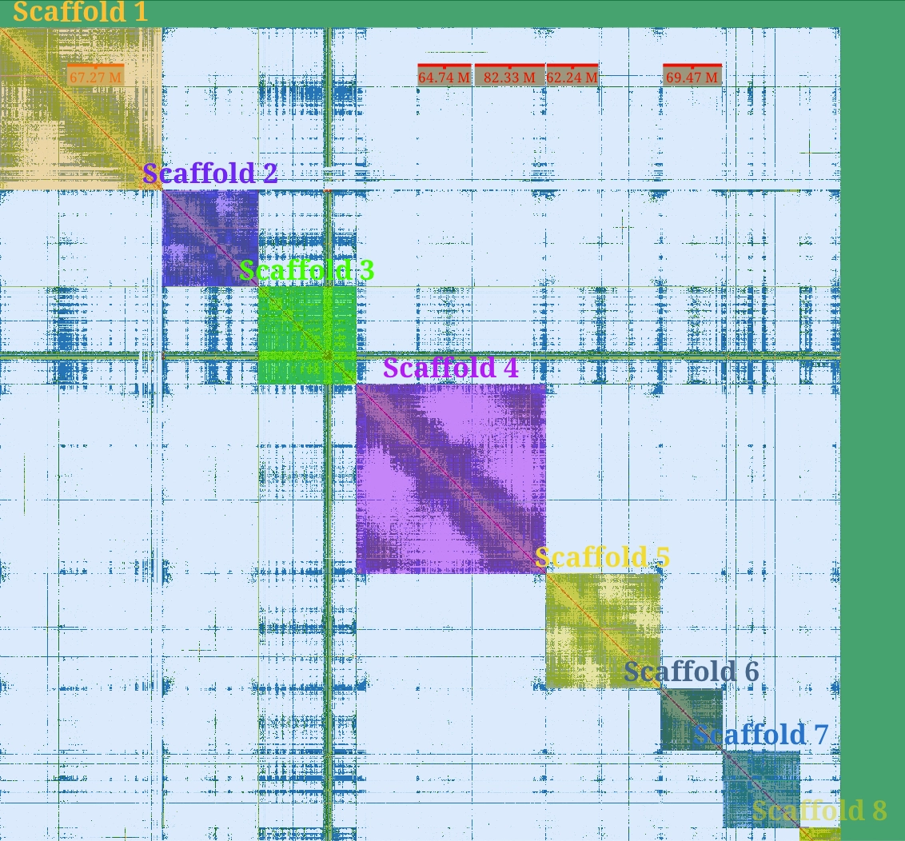
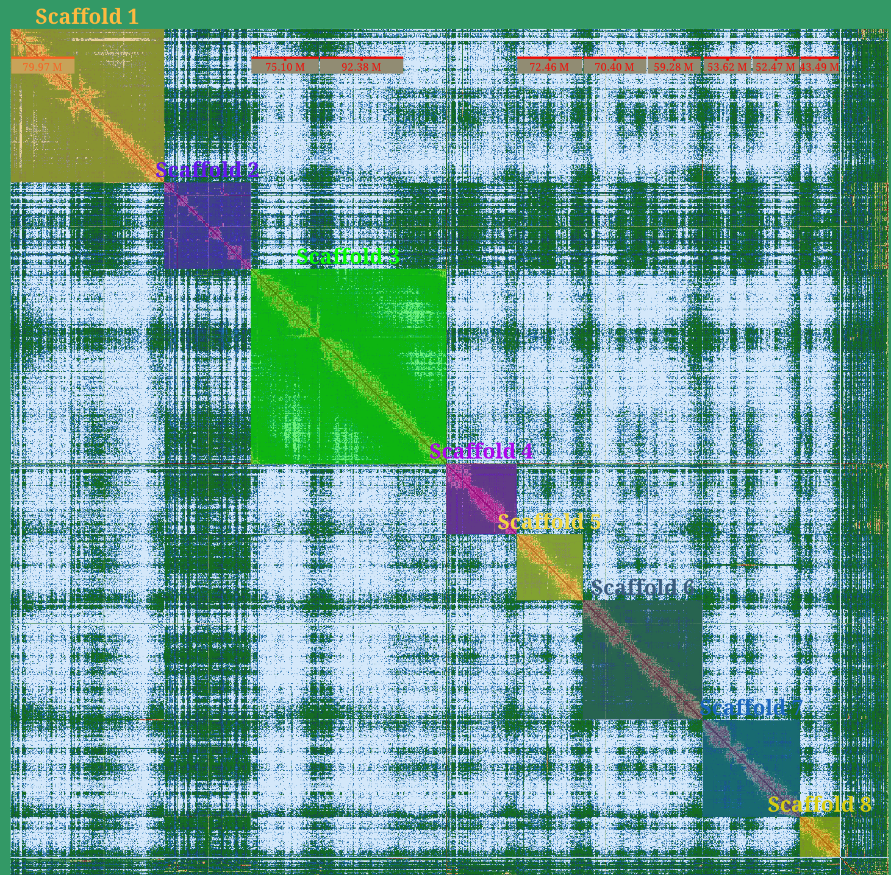
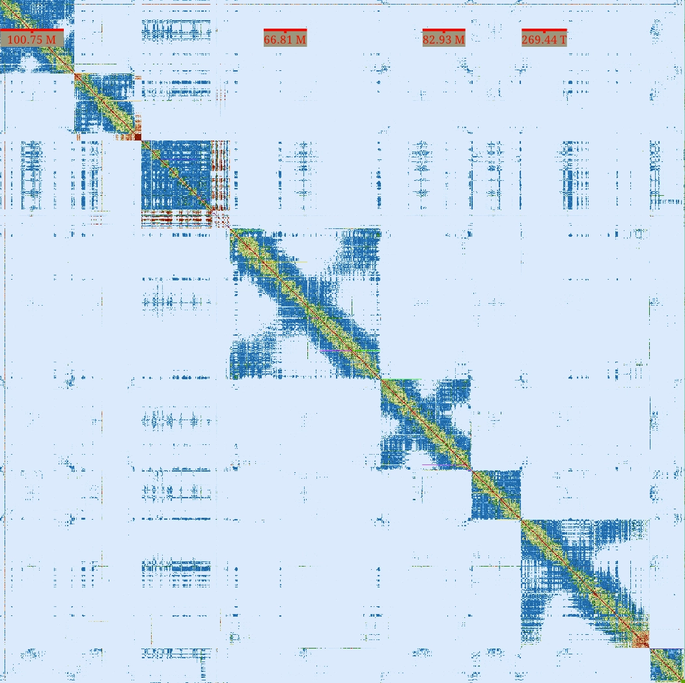
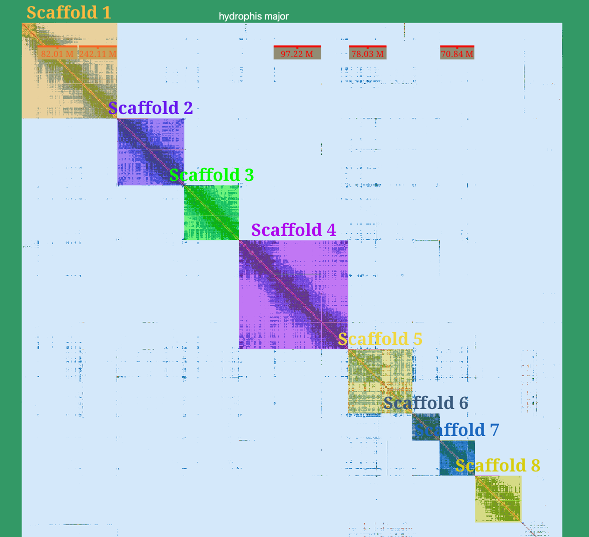
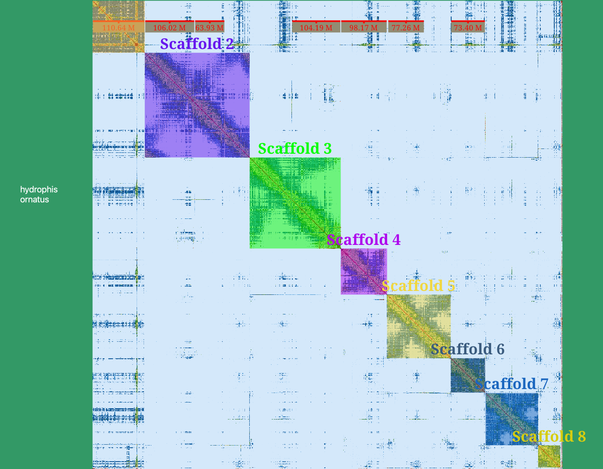
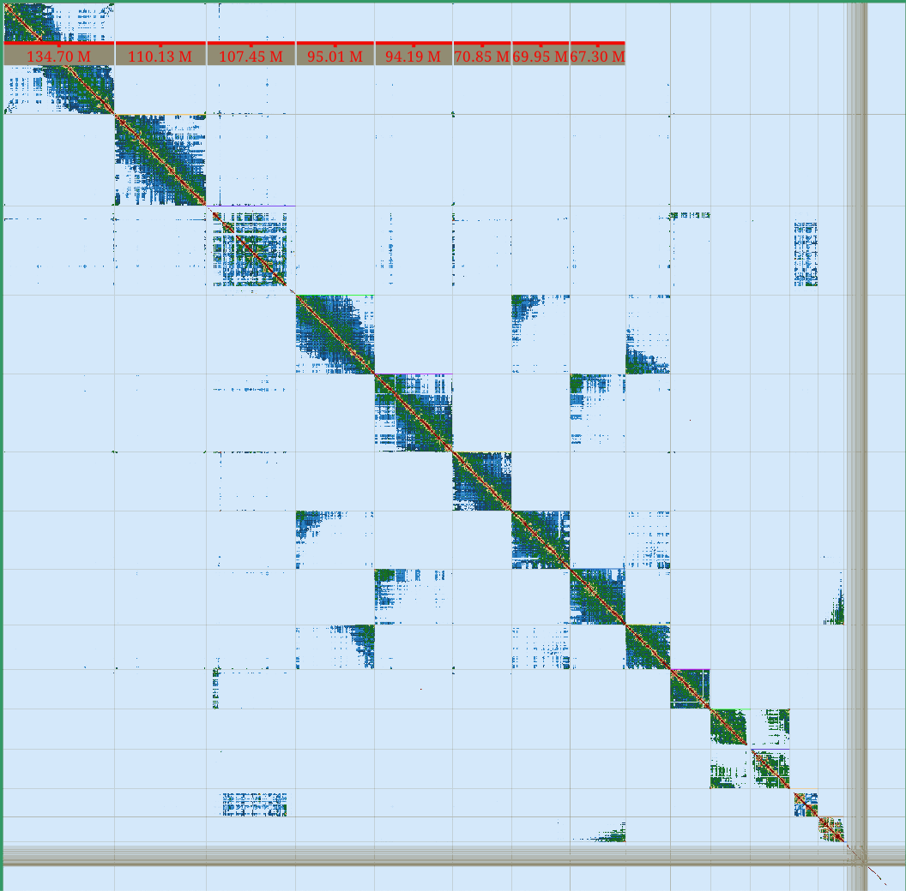

# Manual Curation
---
### Manual curation using `PretextView` 

Attached are the Hi-C heatmaps of the manually curated assemblies for:
1. _H. cyanocinctus_
2. _H. curtus (east)_
3. _H. curtus (west)_
4. _H. major_
5. _H. ornatus_

6. Heatmap prior to curation (for _H. major_)

_Hydrophis major pre-curation:_ 

