# Association of Repetitive Elements at Chemosensory Receptor Genes in *Hydrophis* Genomes
### *`Are LTRs Enriched at Candidate V2R Loci? Could This Help Explain Gene Family Expansion & Copy-Number Variation?`*
**BIOL 4001 — Advanced Biological Sciences · Technical Report**  
---

## Project outline

*Hydrophis* sea snakes shifted from air- to water-borne chemosensation after diverging from terrestrial Australian elapids (~9–18 MYA). Squamates expand vomeronasal type-2 receptor (**V2R**) gene families in tandem arrays; long terminal repeat retrotransposons (**LTRs**) can supply substrates for non-allelic homologous recombination and thus copy-number change. This report tests whether LTR density at V2R loci exceeds spatial null expectations on chromosomes **C2** and **CZ** of a reassembled *H. ornatus* genome, and whether local LTR density predicts larger paralog arrays.

### Aims

| ID | Hypothesis | Approach |
|----|------------|----------|
| **H1** | LTR coverage at V2R loci/clusters exceeds a chromosome-aware spatial null | Permutation enrichment (`regioneR`), cluster-level randomisation, cyclic LTR-track rotation |
| **H2** | V2R cluster paralog count increases with local LTR density | Negative binomial GLM + BH multiple-testing correction |

## Workflow

1. [Reassembled *H. ornatus* genome](../../1_assembly)
2. [Repeat Annotation (EDTA + RepeatMasker)](../README.md)  
   - [Repeat Annotation](../3_repeats)
3. **Proxy V2R Candidate Loci:**
   - [tBLASTn domain scan](../../2_annotation/7tm-proxy-anno)
   - [Profile HMM via HMMER](../../2_annotation/pHMM-proxy-anno)
4. **POC: Complexity of tandem arrays**
   - [Chemosensory complexity analysis](./code_&scripts/chemosensory_tandem_array_complexity.ipynb)
5. **Permutation Enrichment Tests (locus-level)**
   - [03 — Locus-level permutation](./code_&scripts/03_permutation_enrichment.ipynb)
6. **Cluster-level enrichment + cyclic permutation**
   - [04 — Cluster enrichment & cyclic test](./code_&scripts/04_cluster_cyclic_enrichment.ipynb)
7. **Dose-response regression**
   - [05 — NB-GLM dose-response](./code_&scripts/5_dose_response_nb_glm.ipynb)

  **Next/In Progress**
  ```text
  - ROC-AUC Investigation: *Using assembly/complexity features to predict V2R presence*
  - Run workflow on annotated V2Rs
  - Re-annotate LTRs + transposable/repetitive elements with newer tools
  ```

### Null hierarchy (H1)

1. **Null A** — genome-wide shuffle *(biologically invalid -> as V2Rs are chromosome-structured)*
2. **Null B** — shuffle within C2 / CZ only
3. **Null C** — GC-matched resampling
4. **Null D** — exclude low-mappability / coverage-anomaly regions
6. **Cyclic permutation** — rotate LTR track; keep V2Rs fixed *(most conservative)*

### Results
* Genome-wide Null A inflates enrichment (~3.6×) relative to chromosome-matched nulls (~1.4–1.6×).
* Co-localisation + increased abundance of LTRs at V2R loci flanks
   <div align="center"> 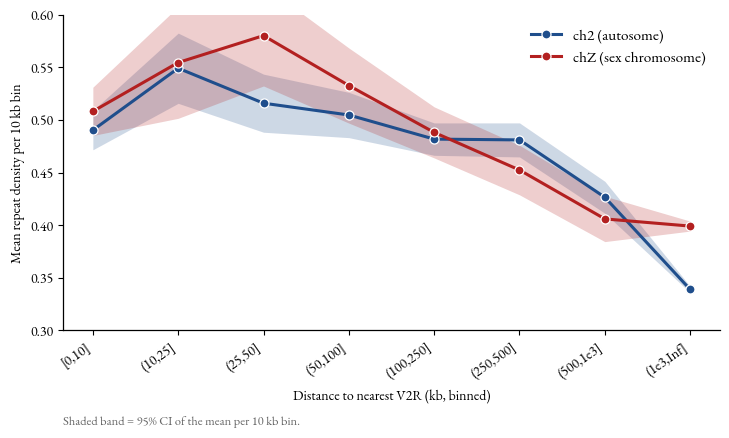 </div>
* Cluster-level enrichment survives on C2 (all nulls significant); CZ is method-sensitive (all nulls except cyclic permutation significant).
* No robust monotonic dose–response between LTR density and cluster size after BH correction.
* Enrichment is concentrated in short LTR/unknown fragments --> compatible with degraded remnants or annotation artefacts, not necessarily intact drivers of duplication.
  <div align="center"> 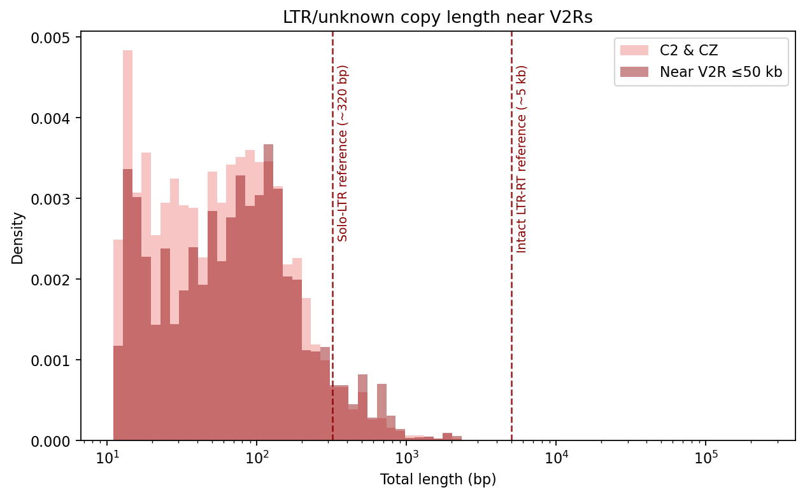 </div>
* Strong co-localisation of V2Rs with low-mappability sequence is a major assembly confound (esp. CZ).
   * <div align="center"> 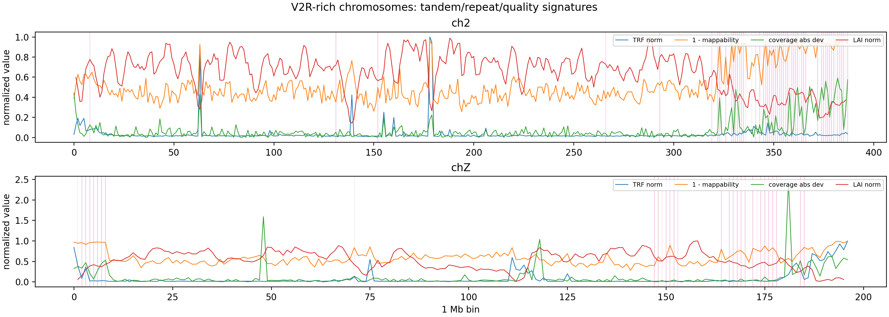 </div>
<div align="center"> 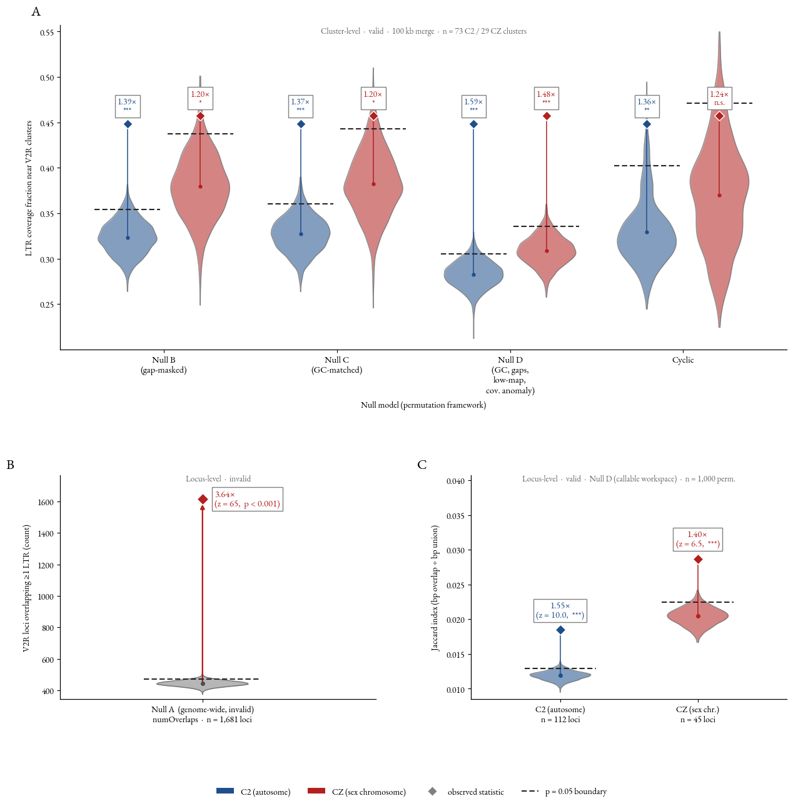 </div>

---

[PDF download](./tech-report-pages/BILLY_TRIM-TECH_REPORT.pdf) · [Analysis scripts](https://github.com/blytrm/Hydrophiinae-genomics/tree/main/3_repeats/LTR-density_atV2Rs)

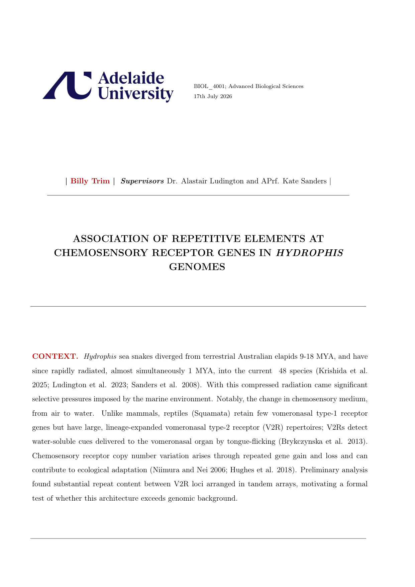
<details>
  <summary><h2>Click to view the full technical report (15 pages)</h2></summary>


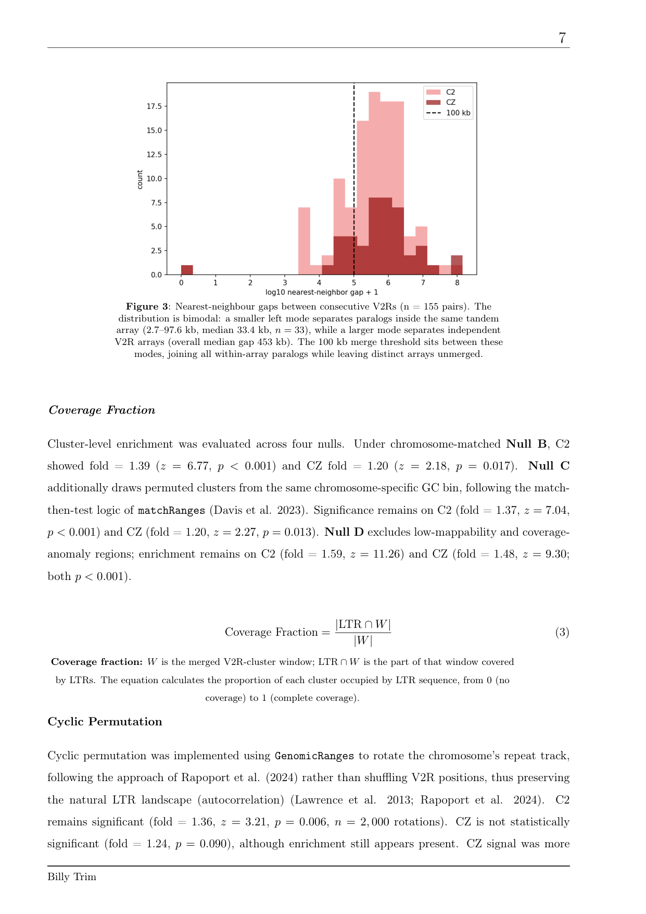


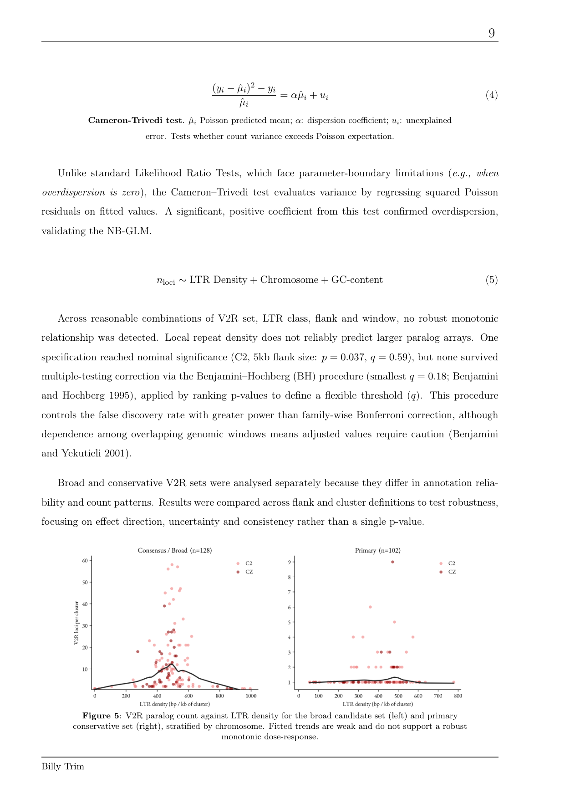

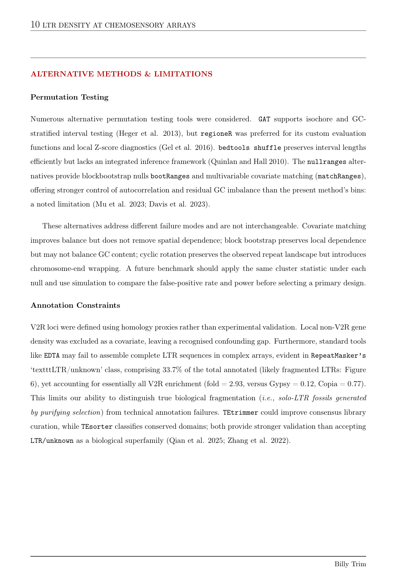

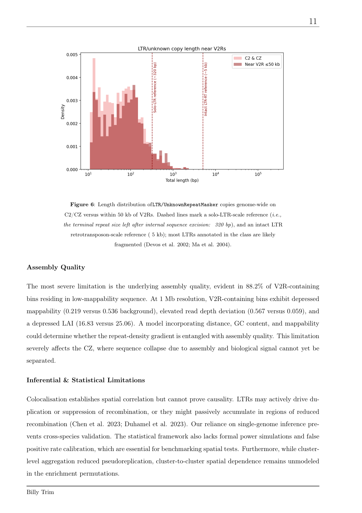

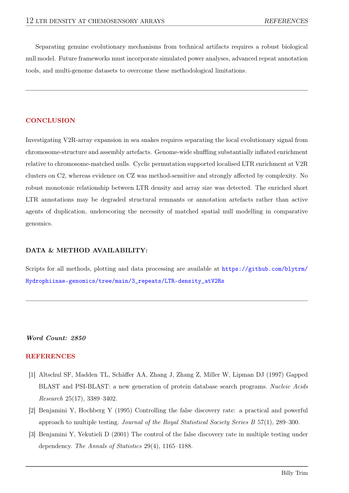

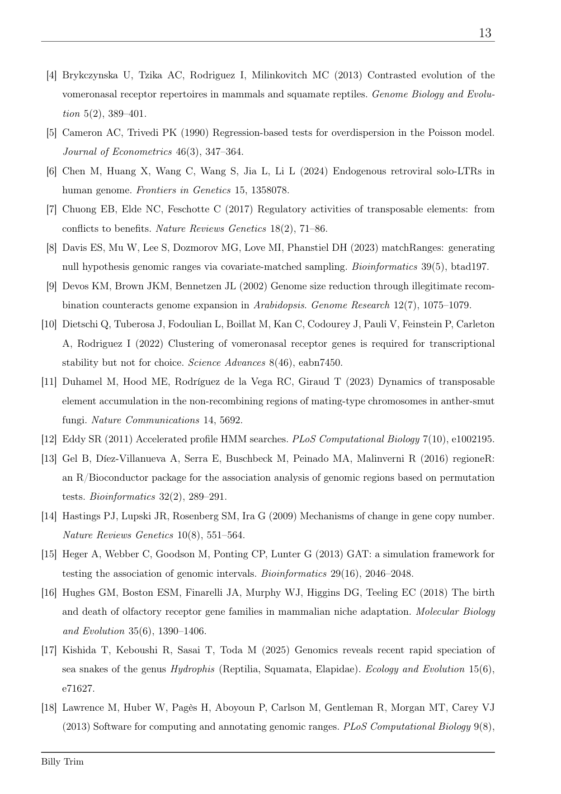

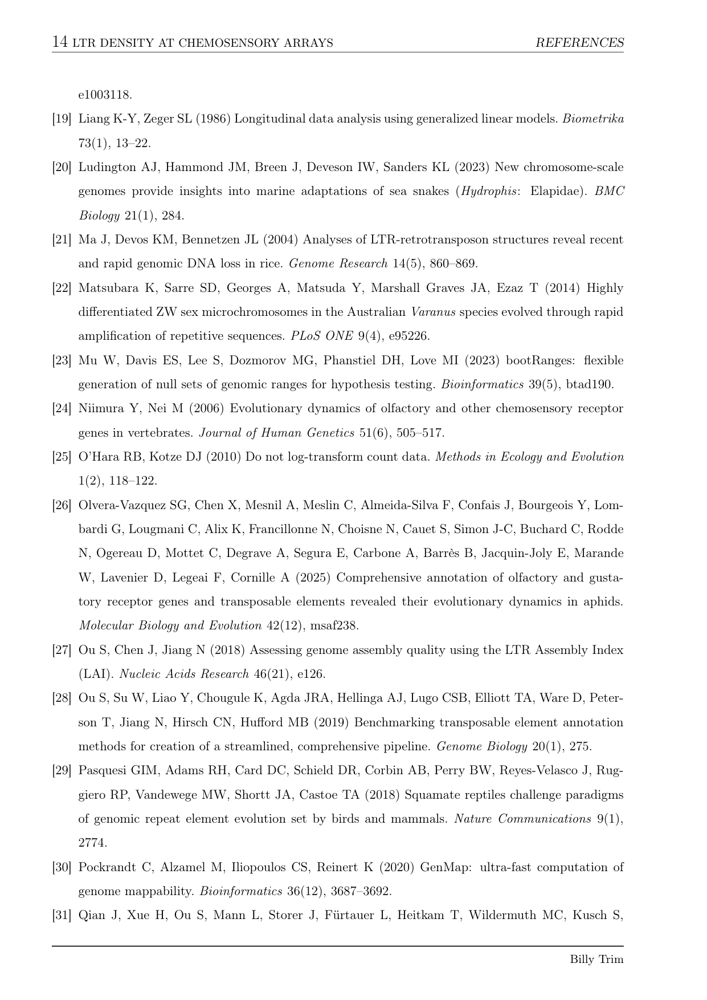

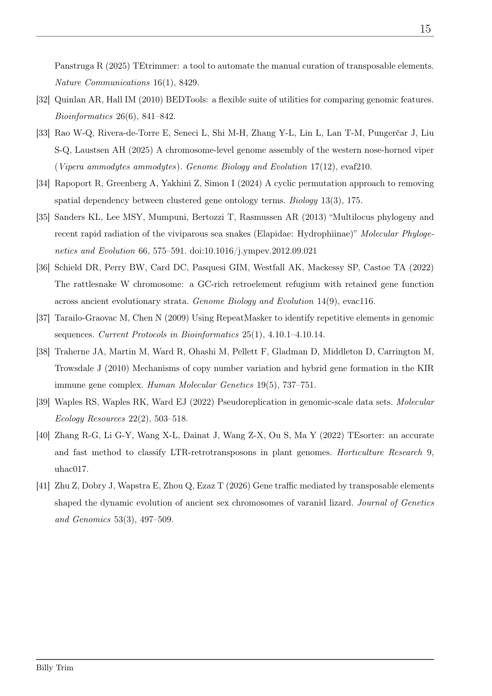

</details>

---

## License/citation

Course technical report (BIOL 4001). Word count: 2,850.
