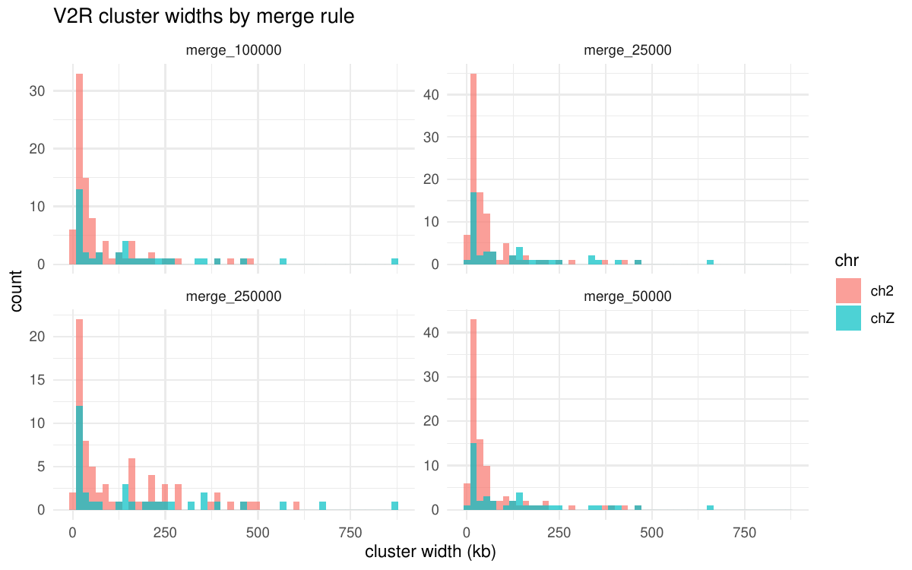
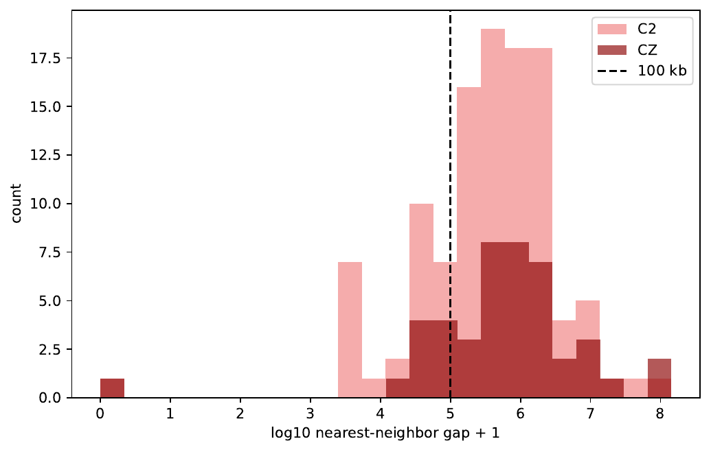

# 02 — V2R filtering + processing

**Data generation** = 3 V2R sets; primary = intact pHMM ∩ tBLASTn.

- **Why three sets:** broad candidates inflate repeat signals; confirmed loci are the biological primary set.
- **Why intersect intact pHMM ∩ tBLASTn:** orthogonal/cross-checked evidence (profile HMM structure + protein homology).

---

## 1. Upstream calling (outside this folder)


| Source                        | What it produces                          | Script |
| ----------------------------- | ----------------------------------------- | ------ |
| pHMM scan + intact validation | `horn_v2r_genes.csv`  |        |
| tBLASTn + filter/merge        | locus BED                                 |        |


Counts on **ch2 + chZ**:


| Set                           | n loci                 |
| ----------------------------- | ---------------------- |
| Consensus (broad)             | 1681                   |
| pHMM all                      | 324                    |
| pHMM intact                   | 239                    |
| tBLASTn                       | 858                    |
| **Primary: intact ∩ tBLASTn** | ~157; 112 ch2 / 45 chZ |


---

## 2. Rebuild primary set (intact ∩ tBLASTn)

```r
# From scripts/v2r_priority_analysis.R

tblastn <- fread(
  "asm/files/synteny/horn/v2r.new.filtered.merged.bed",
  header = FALSE, col.names = c("chr", "start", "end")
)
tblastn[chr == "ch6", chr := "chZ"]
gr_tblastn <- make_gr(tblastn, bed0 = TRUE)

phmm <- fread("v2r_hmm/validation/intact/horn_v2r_genes.csv")
phmm_c2cZ <- phmm[scaffold %in% c("ch2", "chZ")]
gr_phmm <- GRanges(
  seqnames = phmm_c2cZ$scaffold,
  ranges = IRanges(start = as.integer(phmm_c2cZ$start),
                   end = as.integer(phmm_c2cZ$end)),
  strand = phmm_c2cZ$strand,
  class = phmm_c2cZ$class
)

v2r_intact <- gr_phmm[mcols(gr_phmm)$class == "intact"]
gr_tblastn_c2cZ <- gr_tblastn[seqnames(gr_tblastn) %in% c("ch2", "chZ")]

hits <- findOverlaps(v2r_intact, gr_tblastn_c2cZ, minoverlap = 1L)
v2r_intact_tblastn <- v2r_intact[unique(queryHits(hits))]
# → primary set
```

- Consensus set BED kept for sensitivity / secondary checks

---

## 3. Cluster definition (feeds H1 cluster tests + H2)

```r
# Pseudoreplication fix: merge nearby loci into clusters
build_clusters <- function(gr, merge_bp) {
  cl <- reduce(sort(gr), min.gapwidth = as.integer(merge_bp) + 1L)
  mcols(cl)$merge_bp <- merge_bp
  mcols(cl)$n_loci <- countOverlaps(cl, gr, type = "any")
  cl
}

merge_distances <- c(25000, 50000, 100000, 250000)
# Primary merge for report = 100 kb (bimodal nearest-neighbour gaps)
cluster_sets <- lapply(merge_distances, function(d)
  build_clusters(v2r_intact_tblastn, d))
```

- **Why 100 kb:** nearest-neighbour gap distribution is bimodal; 100 kb captures tandem arrays without merging distant islands (below)






Figure (above). Nearest-neighbour gaps between consecutive V2Rs (n = 155 pairs). The distribution is bimodal: a smaller left mode separates paralogs inside the same tandem array (2.7–97.6 kb, median 33.4 kb, n = 33), while a larger mode separates independent V2R arrays (overall median gap 453 kb). The 100 kb merge threshold sits between these modes, joining all within-array paralogs while leaving distinct arrays unmerged.

---

## 4. Analysis sets used later

```r
A_sets <- list(
  consensus = v2r_consensus,       # broad
  intact = v2r_intact,             # pHMM-intact only
  intact_tblastn = v2r_intact_tblastn  # PRIMARY
)
```

3. locus-level permutation (exploratory; inflated by tandem dependence).
4. cluster-level + Null C/D + cyclic 
5. NB-GLM dose–response on cluster `n_loci` ~ LTR density

