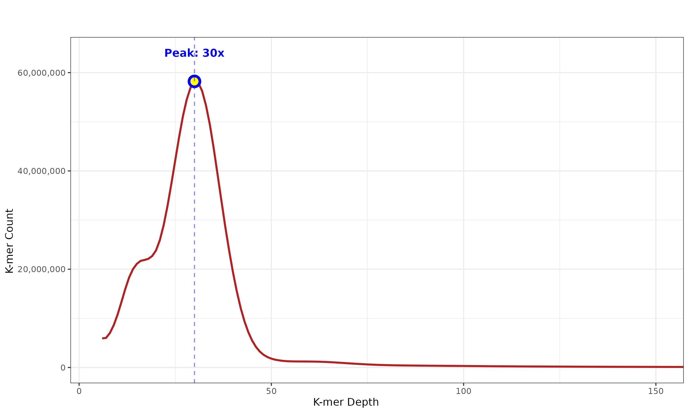

# K-mer Spectrum Analysis
## Finding the homozygous peak from raw reads 
### For use in ``Hifiasm`` parameter "``--hom-cov``"



### Run yak
```bash
yak count -b37 -t32 -o hmaj.yak hydmaj.fastq.gz
yak investigate hmaj.yak > hmaj.hist
```

## Plot histogram with labelled peak
```R
raw_data <- read.table("hmaj.hist", fill = TRUE)
hist_data <- raw_data[raw_data$V1 == "HS", ]

# V2 is Depth, V4 is the Count
plot_data <- data.frame(
  Depth = as.numeric(hist_data$V2),
  Count = as.numeric(hist_data$V4)
)

# Find the maximum value (homozygous peak)
# Filter data to avoid error peak at start (Depth > 5)
filtered_data <- plot_data[plot_data$Depth > 5, ]
max_idx <- which.max(filtered_data$Count)
max_depth <- filtered_data$Depth[max_idx]
max_count <- filtered_data$Count[max_idx]

# Print the maximum value
cat(sprintf("Homozygous peak found at:\n"))
cat(sprintf("  Depth: %d\n", max_depth))
cat(sprintf("  Count: %s\n\n", format(max_count, big.mark = ",")))

# 4. Plot the data
p <- ggplot(filtered_data, aes(x = Depth, y = Count)) +
  geom_line(color = "firebrick", linewidth = 1) +
  # Mark the maximum point
  geom_point(data = data.frame(Depth = max_depth, Count = max_count),
             size = 4, color = "blue", shape = 21, fill = "yellow", stroke = 2) +
  # Add vertical line at maximum
  geom_vline(xintercept = max_depth, linetype = "dashed", color = "blue", alpha = 0.5) +
  # Add text annotation
  annotate("text", x = max_depth, y = max_count * 1.1,
           label = sprintf("Peak: %dx", max_depth),
           color = "blue", fontface = "bold", size = 4) +
  scale_y_continuous(labels = scales::comma) +
  coord_cartesian(xlim = c(5, 150)) + # Adjust 150 to your expected max depth
  theme_bw() +
  labs(
    title = "K-mer Spectrum",
    x = "K-mer Depth",
    y = "K-mer Count"
  )

# Save the plot
ggsave("hmaj_kmer_distribution.png", plot = p, width = 10, height = 6, dpi = 300)
cat("Plot saved to hmaj_kmer_distribution.png\n")
```
